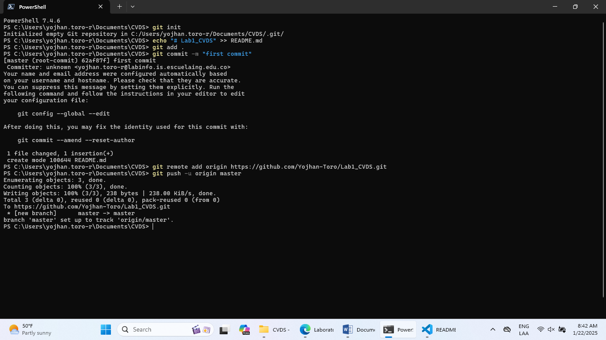
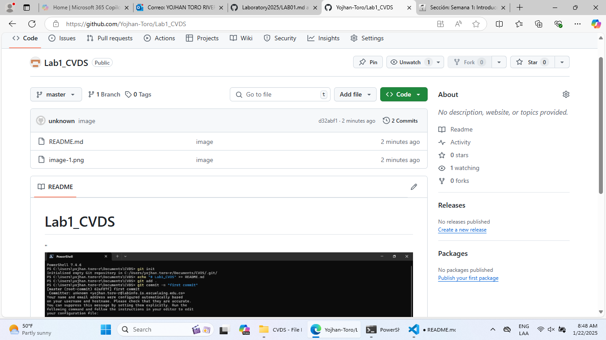
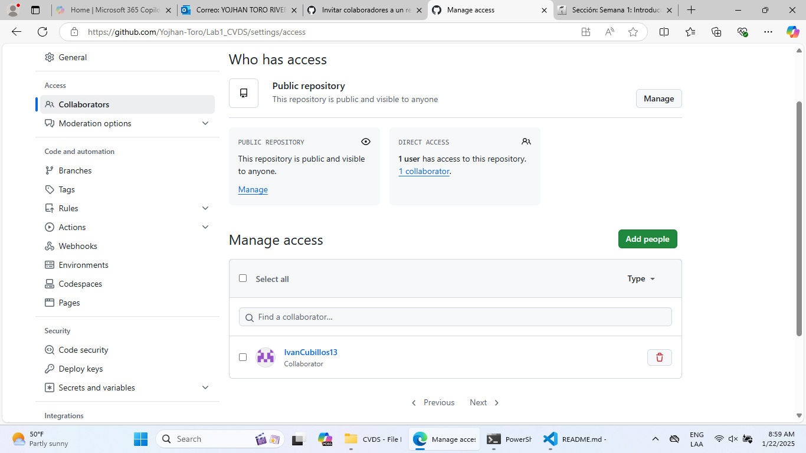

# Lab1_CVDS
Creamos la carpeta y enlazamos con el git 

Comprobamos que se realizaron los cambios

# Parte II

Invitamos a el colaborador

Owner y Colaborador editan el archivo README.md al mismo tiempo e intentan subir los cambios al mismo tiempo.

aa