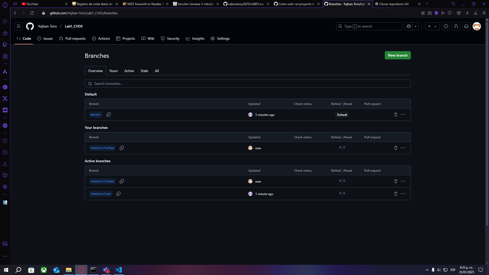
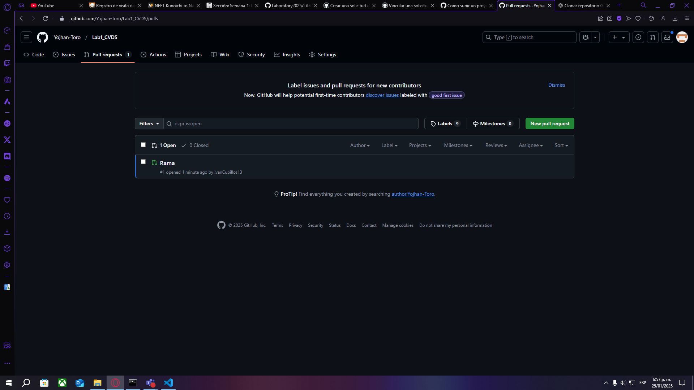
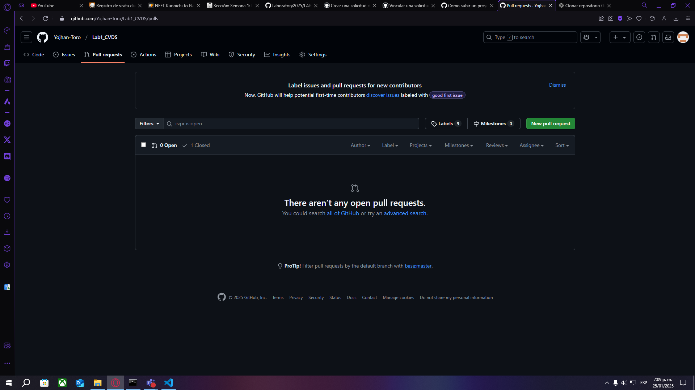
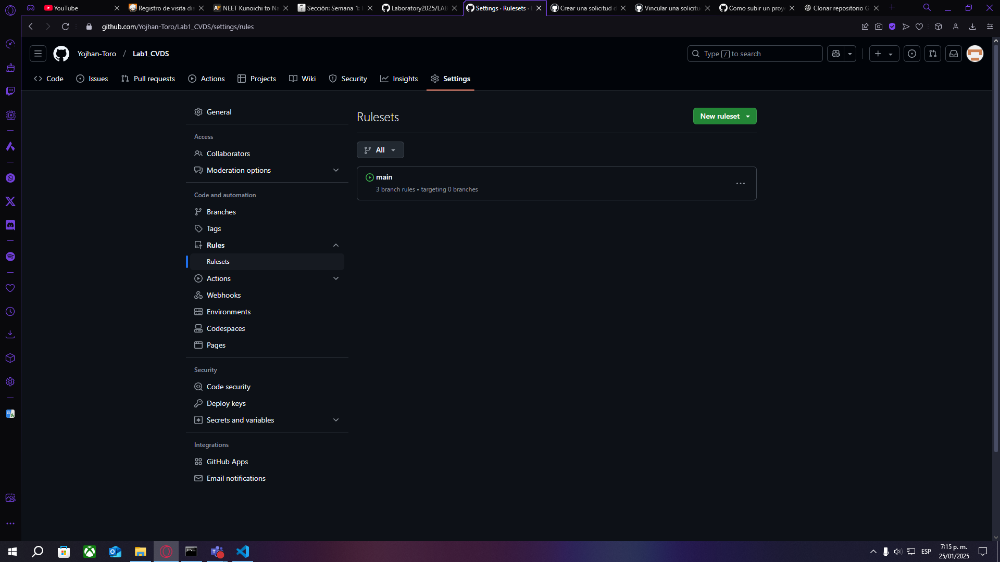

# Lab1_CVDS
Creamos la carpeta y enlazamos con el git 

Comprobamos que se realizaron los cambios

# Parte II

Invitamos a el colaborador

Owner y Colaborador editan el archivo README.md al mismo tiempo e intentan subir los cambios al mismo tiempo.

# Parte III

¿Hay una mejor forma de trabajar con git para no tener conflictos?
Crear una rama para cada desarrollador 

¿Qué es y como funciona el Pull Request?

Un Pull Request (PR) es una solicitud para proponer cambios en un repositorio. Funciona así:

Haces cambios en una rama nueva.
Subes la rama al repositorio remoto (git push).
Creas el PR.
Otros revisan los cambios.
Si se aprueba, se fusiona con la rama principal.
Sirve para colaborar, revisar y evitar errores en equipo.

Creen una rama cada uno y suban sus cambios

Tanto owner como colaborador hacen un cambio en el README.md y hacen un Pull Request (PR) a la rama main/master

Teniendo en cuenta la recomendación, mezclen los cambios a la rama main a través de PR con el check/review/approval del otro compañero (Cuando se hace merge se deberían borrar las ramas en github)

